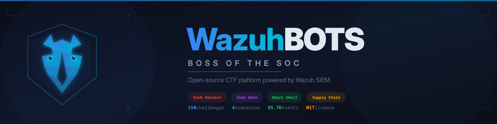

# WazuhBOTS -- Boss of the SOC

[](LICENSE)
[](https://wazuh.com)
[](#quick-start)
[](#quick-start)
[](#scenarios)
[](#)

**A "Boss of the SOC" CTF platform built entirely on open-source tools, with Wazuh SIEM at its core.**

WazuhBOTS brings the BOTS (Boss of the SOC) competition format to the Wazuh ecosystem. Participants investigate realistic, pre-generated security incidents by querying Wazuh alerts, correlating events across multiple data sources, and submitting answers as CTF flags.

With **150 challenges across 4 attack scenarios**, WazuhBOTS surpasses the combined scope of all three Splunk BOTS competitions (BOTSv1 + BOTSv2 + BOTSv3 = ~136 challenges).

Created by **MrHacker (Kevin Munoz)** -- Wazuh Technology Ambassador.

---

## Table of Contents

- [Quick Start](#quick-start)
- [Prerequisites](#prerequisites)
- [Architecture](#architecture)
- [Default Credentials](#default-credentials)
- [Scenarios](#scenarios)
- [Difficulty Levels](#difficulty-levels)
- [Hardware Requirements](#hardware-requirements)
- [Troubleshooting](#troubleshooting)
- [Scripts & Tooling](#scripts--tooling)
- [Project Structure](#project-structure)
- [Contributing](#contributing)
- [Credits](#credits)
- [License](#license)

---

## Prerequisites

- **Linux** (any modern distro: Ubuntu, Fedora, Arch, Debian, etc.)
- **Docker + Docker Compose** (v2) **or** **Podman + podman-compose**
- **curl**, **python3**, **openssl** (usually pre-installed)
- **16 GB+ RAM** (2 GB reserved for the Wazuh Indexer heap)
- **20 GB+ free disk** for images and data

The setup script auto-detects whether you have Docker or Podman and adjusts accordingly.

---

## Quick Start

```bash
# 1. Clone the repository
git clone https://github.com/TheSL18/wazuhbots.git
cd wazuhbots

# 2. Run the automated setup
chmod +x scripts/setup.sh
./scripts/setup.sh

# 3. Access the platform (URLs shown at end of setup)
```

The setup script will:

1. Check all prerequisites (Docker/Podman, disk space, RAM)
2. Generate TLS certificates for the Wazuh stack
3. Generate secure random passwords (stored in `.env`)
4. Deploy containers in 3 phases (indexer first, then securityadmin, then dashboard)
5. Wait for all services to become healthy
6. Ingest ~95,000 alert documents into the Wazuh Indexer
7. Show access URLs and credentials

### What the 3-phase deploy does

The Wazuh Indexer (OpenSearch) requires `securityadmin.sh` to initialize its security configuration before the Dashboard can connect. The setup script handles this automatically:

- **Phase 1**: Start Indexer, Manager, and CTFd stack
- **Phase 2**: Wait for Indexer HTTPS, run `securityadmin.sh` to initialize security
- **Phase 3**: Start Dashboard, Nginx, and victim machines

---

## Architecture

```
+------------------------------------------------------------------+
|                     WazuhBOTS Infrastructure                     |
+------------------------------------------------------------------+
|                                                                  |
|  [Participants]                                                  |
|       |                                                          |
|  +----v-----------+                                              |
|  |  Nginx Proxy   |  :8880 (HTTP) / :8443 (HTTPS)               |
|  +---+--------+---+                                              |
|      |        |                                                  |
|  +---v----+  +v---------+                                        |
|  | Wazuh  |  |  CTFd    |  :8000                                 |
|  | Dash   |  |Scoreboard|                                        |
|  | :5601  |  +----+-----+                                        |
|  +---+----+       |                                              |
|      |       +----+-----+-------+                                |
|  +---v------+| MariaDB  | Redis |                                |
|  |  Wazuh   || (CTFd DB)| :6379 |                                |
|  |  Indexer  |+---------+-------+                                |
|  |(OpenSearch)                                                   |
|  |  :9200   |                                                    |
|  +---+------+                                                    |
|      |                                                           |
|  +---v--------+                                                  |
|  |   Wazuh    |  :1514 (agents) / :55000 (API)                   |
|  |   Manager  |                                                  |
|  +---+----+---+                                                  |
|      |    |                                                      |
|  +---v-+ +v------+                                               |
|  |web- | |lnx-   |  Victim containers with Wazuh agents         |
|  |srv  | |srv    |                                               |
|  +-----+ +-------+                                               |
+------------------------------------------------------------------+
```

| Component     | Technology                 | Container Name       |
| ------------- | -------------------------- | -------------------- |
| SIEM Core     | Wazuh Manager 4.14.3       | wazuhbots-manager    |
| Indexer       | Wazuh Indexer (OpenSearch) | wazuhbots-indexer    |
| Dashboard     | Wazuh Dashboard 4.14.3     | wazuhbots-dashboard  |
| CTF Platform  | CTFd                       | wazuhbots-ctfd       |
| CTFd Database | MariaDB 10.11              | wazuhbots-ctfd-db    |
| CTFd Cache    | Redis 7                    | wazuhbots-ctfd-redis |
| Reverse Proxy | Nginx (Alpine)             | wazuhbots-nginx      |
| Victim: Web   | Apache + DVWA + Agent      | wazuhbots-web-srv    |
| Victim: Linux | Ubuntu + SSH + Agent       | wazuhbots-lnx-srv    |

---

## Default Credentials

After running `setup.sh`, all generated passwords are stored in `.env`. The key default credentials are:

| Service           | URL                     | Username           | Password           |
| ----------------- | ----------------------- | ------------------ | ------------------ |
| Wazuh Dashboard   | https://localhost:5601  | admin              | admin              |
| Wazuh API         | https://localhost:55000 | wazuh-wui          | _(from .env)_      |
| CTFd              | http://localhost:8000   | _(setup required)_ | _(setup required)_ |
| Nginx (Dashboard) | http://localhost:8880   | _(proxied)_        | _(proxied)_        |

> **Note**: Wazuh Indexer 4.14.3 uses `admin` / `admin` as the default admin password. The `INDEXER_PASSWORD` in `.env` is used by Filebeat and the Manager to connect, but the Dashboard login is `admin` / `admin`.

### CTFd Initial Setup

After deployment, CTFd requires a one-time setup through the browser:

1. Go to http://localhost:8000
2. You will be redirected to `/setup`
3. Create the admin account and configure the competition name
4. After setup, generate an API token at http://localhost:8000/settings#tokens
5. Load challenges: `CTFD_ACCESS_TOKEN=<token> python3 scripts/generate_flags.py --clear-existing`

---

## Scenarios

| #   | Codename                   | Attack Type                               | Victim    | Challenges | Alerts      |
| --- | -------------------------- | ----------------------------------------- | --------- | ---------- | ----------- |
| 1   | **Operation Dark Harvest** | Web App Compromise (SQLi, web shell)      | `web-srv` | 36         | 900         |
| 2   | **Operation Iron Gate**    | AD Attack Chain (Mimikatz, Kerberoasting) | `dc-srv`  | 36         | 1,200       |
| 3   | **Ghost in the Shell**     | Linux Rootkit (SSH brute force, C2)       | `lnx-srv` | 36         | 9,000       |
| 4   | **Supply Chain Phantom**   | Multi-Vector Supply Chain Attack          | All hosts | 42         | 600         |
|     | **+ Baseline Noise**       | Normal operations noise                   | All hosts | --         | ~84,000     |
|     | **Total**                  |                                           |           | **150**    | **~95,700** |

---

## Difficulty Levels

| Level | Name       | Target Profile           | Points | Query Complexity         |
| ----- | ---------- | ------------------------ | ------ | ------------------------ |
| 1     | **Pup**    | SOC Analyst N1 / Student | 100    | 1 filter, 1 field        |
| 2     | **Hunter** | SOC Analyst N2           | 200    | 2-3 filters, time ranges |
| 3     | **Alpha**  | Threat Hunter / IR       | 300    | Complex aggregations     |
| 4     | **Fenrir** | Expert / Red Team        | 500    | Multi-source correlation |

---

## Hardware Requirements

| Deployment Scenario           | CPU      | RAM   | Disk       |
| ----------------------------- | -------- | ----- | ---------- |
| Development / Personal        | 4 cores  | 16 GB | 20 GB SSD  |
| Meetup (10-20 participants)   | 8 cores  | 32 GB | 100 GB SSD |
| CTF Public (50+ participants) | 16 cores | 64 GB | 200 GB SSD |

---

## Troubleshooting

### Health Check

```bash
./scripts/health_check.sh          # Full health check with colors
./scripts/health_check.sh --json   # JSON output for automation
```

### Common Issues

**Containers fail to start (Podman)**

```bash
# Podman rootless needs special UID mapping for cert files
# The setup script handles this automatically, but if certs have wrong ownership:
podman unshare chown -R 0:0 config/wazuh_indexer_ssl_certs/
```

**Dashboard shows "Indexer connection error"**

```bash
# securityadmin may not have run. Re-run it manually:
docker exec -u root wazuhbots-indexer bash -c \
  "export JAVA_HOME=/usr/share/wazuh-indexer/jdk && \
   /usr/share/wazuh-indexer/plugins/opensearch-security/tools/securityadmin.sh \
   -cd /usr/share/wazuh-indexer/config/opensearch-security/ \
   -cacert /usr/share/wazuh-indexer/config/certs/root-ca.pem \
   -cert /usr/share/wazuh-indexer/config/certs/admin.pem \
   -key /usr/share/wazuh-indexer/config/certs/admin-key.pem \
   -h localhost -nhnv -icl"
```

**Indexer returns 503**
The indexer needs time to initialize after starting. Wait 30-60 seconds after container start. The setup script handles the wait automatically.

**Certificate generation fails**

```bash
# Regenerate certificates
docker compose -f generate-indexer-certs.yml run --rm generator
```

**Reset everything and start fresh**

```bash
docker compose down -v   # Remove containers and volumes
rm -rf config/wazuh_indexer_ssl_certs/
rm -f .env
./scripts/setup.sh       # Redeploy from scratch
```

---

## Scripts & Tooling

| Script                         | Purpose                                                      |
| ------------------------------ | ------------------------------------------------------------ |
| `scripts/setup.sh`             | Full automated deployment (certs, passwords, deploy, ingest) |
| `scripts/health_check.sh`      | Verify all services are running and reachable                |
| `scripts/ingest_datasets.py`   | Ingest alert datasets into Wazuh Indexer                     |
| `scripts/generate_flags.py`    | Import CTF challenges into CTFd via API                      |
| `scripts/generate_datasets.py` | Regenerate deterministic alert datasets                      |
| `scripts/verify_flags.py`      | Verify all 150 flags against datasets                        |
| `scripts/reset_environment.sh` | Reset between competitions                                   |

---

## Project Structure

```
wazuhbots/
|-- docker-compose.yml              # Full-stack orchestration (9 services)
|-- generate-indexer-certs.yml      # TLS certificate generation
|-- .env.example                    # Environment variable template
|-- Makefile                        # Common shortcuts
|
|-- config/
|   |-- certs.yml                   # Certificate generation config
|   |-- wazuh_indexer/
|   |   |-- wazuh.indexer.yml       # OpenSearch config (mounted as opensearch.yml)
|   |-- wazuh_dashboard/
|       |-- opensearch_dashboards.yml
|       |-- wazuh.yml
|
|-- docker/
|   |-- nginx/nginx.conf            # Reverse proxy config
|   |-- wazuh-manager/config/       # ossec.conf, local_rules.xml
|   |-- victims/
|       |-- web-srv/                # Apache + DVWA + Wazuh Agent
|       |-- lnx-srv/                # Ubuntu + SSH + auditd + Agent
|
|-- datasets/                       # Pre-generated attack datasets (~95K alerts)
|   |-- scenario1_dark_harvest/
|   |-- scenario2_iron_gate/
|   |-- scenario3_ghost_shell/
|   |-- scenario4_supply_chain/
|   |-- baseline_noise/
|
|-- scripts/
|   |-- setup.sh                    # Automated full deployment
|   |-- health_check.sh             # Service verification
|   |-- generators/                 # Deterministic alert generators
|   |-- ingest_datasets.py          # Dataset ingestion
|   |-- generate_flags.py           # CTFd challenge loader
|
|-- ctfd/challenges/                # 150 challenge definitions (JSON)
|-- wazuh/rules/                    # Custom detection + correlation rules
|-- branding/                       # Logos, badges, certificates
|-- docs/                           # Extended documentation
```

---

## Contributing

Contributions are welcome. See [docs/CREATING_SCENARIOS.md](docs/CREATING_SCENARIOS.md) for the scenario template format.

1. Fork the repository
2. Create a feature branch (`git checkout -b feature/new-scenario`)
3. Test locally with `./scripts/setup.sh`
4. Submit a pull request

---

## Credits

**Creator and Maintainer**

- **MrHacker (Kevin Munoz)** -- Wazuh Technology Ambassador

**Powered By**

- [Wazuh](https://wazuh.com) -- Open source security monitoring platform
- [CTFd](https://ctfd.io) -- Capture The Flag platform
- [Docker](https://docker.com) / [Podman](https://podman.io) -- Container runtimes

---

## License

WazuhBOTS is released under the **MIT License**. See [LICENSE](LICENSE) for the full text.

```
Copyright (c) 2026 MrHacker (Kevin Munoz)
```
